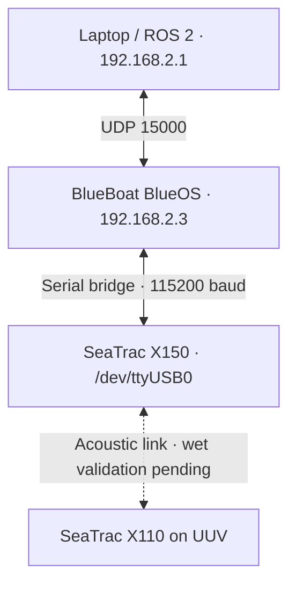
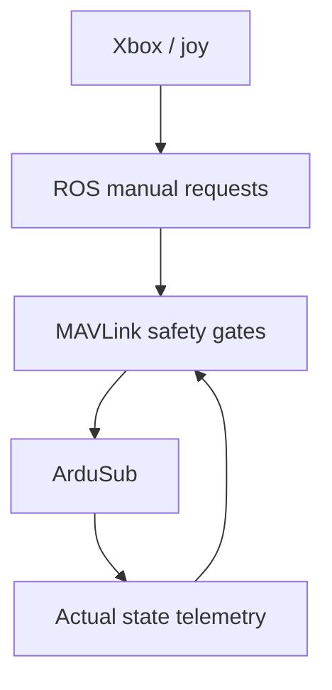

<div align="center">

# RobotX PUCP 2026

### Autonomous Maritime Robotics Software Stack

**Pontificia Universidad Católica del Perú**

ROS 2 · MAVLink · BlueOS · Perception · Control · Simulation · Marine Robotics

</div>

---

## Documentation status — 9 September 2026

This README is the single operating and development reference for the repository. It combines the existing USV, SeaTrac, UUV and simulation documentation with the latest BlueROV2 bench results. A package being present is distinguished from a behavior tested on the vehicle.

The current real-UUV baseline is **Ubuntu 24.04, ROS 2 Jazzy, Python 3.12 and ArduSub 4.5.7 on Navigator**. Camera video, state telemetry, Xbox input, dashboard accessories and disarmed mode requests have been exercised. Live DVL navigation and measured distance/angle accuracy still require a controlled pool test. The new sequence executor and home functions are not implemented yet.

The existing USV and SeaTrac results are retained below. Their older build instructions use Humble; their compatibility with Jazzy and the UUV simulation were not revalidated during this latest UUV session.

| Repository milestone | Evidence |
|---|---|
| UUV code integrated into `main` | `33b9b92` — telemetry and dashboard controls |
| Documentation updated and preserved | `dc92465`, then `0b52d6e` |
| Working branch | `main`; the merged `jazzy-uuv-migration` branch was deleted |
| Latest physical stage | Bench verification completed for the capabilities listed above; pool navigation validation pending |

### Contents

- [Repository layout](#repository-organization)
- [BlueBoat packages and validated telemetry](#usv--blueboat)
- [Shared SeaTrac services](#system--shared-robotx-services)
- [UUV baseline, milestones and packages](#uuv--bluerov2-heavy)
- [UUV telemetry, DVL and planned sequences](#uuv-telemetry-dvl-and-navigation)
- [Simulation and component tests](#uuv-simulation)
- [Build and environment setup](#building-the-workspaces)
- [Dashboard and other launch profiles](#running-the-main-systems)
- [Individual UUV nodes](#uuv-important-individual-nodes)
- [Manual-control safety](#uuv-manual-control-safety-architecture)
- [Simulation nodes](#uuv-simulation--important-nodes)
- [BlueBoat commands](#usv--main-commands)
- [Development status and next steps](#development-status)
- [Git workflow](#git-workflow)

---

## Overview

This repository contains the ROS 2 software stack developed by the **RobotX PUCP Team** for the **Maritime RobotX Challenge 2026**.

The project integrates the software required for the team's surface, underwater and aerial robotic platforms, including:

- Hardware interfaces
- Teleoperation
- Motion control
- Autonomous navigation
- Perception
- Safety systems
- Mission execution
- Simulation
- Hardware testing

The repository is organized by robotic platform and software functionality in order to keep the system modular, maintainable and scalable as new sensors, actuators and RobotX missions are incorporated. Shared subsystems that coordinate more than one vehicle are placed in `SYSTEM_ws` instead of being owned by a single vehicle workspace.

---

## Robotic Platforms

| Platform | Vehicle | Purpose | Status |
|:---:|---|---|:---:|
| **USV** | Blue Robotics **BlueBoat** | Autonomous surface navigation and RobotX mission execution | 🟡 Development |
| **UUV** | Blue Robotics **BlueROV2 Heavy** | Teleoperation, inspection and planned autonomous sequences | 🟢 Bench telemetry/UI · 🟡 wet navigation pending |
| **UAV** | **Holybro X500 V2** | Aerial support; PX4/QGroundControl work handled separately | ⚪ ROS workspace integration pending |

**Status:**
🟢 Integrated · 🟡 In development · ⚪ Pending

---

# Repository Organization

```text
Robotx_PUCP/
│
├── assets/
│   ├── images/
│   └── logos/
│
├── docs/
│
├── USV_ws/
│   ├── hardware_tests/
│   └── src/
│       └── usv/
│           ├── usv_bringup/
│           ├── usv_control/
│           ├── usv_hardware/
│           ├── usv_mavlink/
│           ├── usv_perception/
│           └── usv_teleop/
│
├── UUV_ws/
│   ├── docs/
│   │   └── commands/
│   │       ├── real/
│   │       └── simulation/
│   ├── hardware_tests/
│   │   ├── camera/
│   │   ├── dvl/
│   │   └── ping360/
│   ├── real_ws/
│   │   └── src/
│   │       ├── bringup/
│   │       │   └── uuv_bringup/
│   │       ├── control/
│   │       │   ├── camera_control/
│   │       │   ├── rov_control/
│   │       │   └── uuv_teleop/
│   │       ├── drivers/
│   │       │   ├── bluerov2_camera/
│   │       │   ├── ping360_ros2/
│   │       │   └── uuv_mavlink/
│   │       ├── experimental/
│   │       ├── perception/
│   │       ├── tasks/
│   │       ├── third_party/
│   │       └── ui/
│   │           └── uuv_dashboard/
│   └── simulation_ws/
│       └── src/
│           ├── control/
│           ├── sensors/
│           ├── simulator/
│           └── tasks/
│
├── SYSTEM_ws/
│   ├── docs/
│   │   └── commands/
│   │       └── COMANDOS_USBL
│   ├── hardware_tests/
│   │   └── usbl/
│   │       ├── test_system_info_udp.py
│   │       └── test_status_udp.py
│   └── src/
│       └── usbl/
│           └── seatrac_ros2/
│               ├── config/
│               │   ├── freshwater.yaml
│               │   └── seawater.yaml
│               ├── launch/
│               │   └── usbl.launch.py
│               └── seatrac_ros2/
│                   ├── seatrac_serial_node.py
│                   ├── seatrac_status_node.py
│                   └── seatrac_udp_node.py
│
├── UAV_ws/
│   ├── hardware_tests/
│   └── src/
│
└── README.md
```

---

# USV — BlueBoat

The Unmanned Surface Vehicle is based on the **Blue Robotics BlueBoat**.

Its ROS 2 software is located in:

```text
USV_ws/src/usv/
```

and is divided according to functionality.

### `usv_bringup`

Launch and startup configuration for the USV.

It is intended to provide a centralized way to start the required USV subsystems instead of manually running every node in a separate terminal.

### `usv_control`

Contains the main motion and navigation control nodes.

### `usv_hardware`

Contains interfaces with the physical hardware installed on the BlueBoat.

Current hardware-related development includes:

- Beacon system
- Reel mechanism
- MG6010 CAN motor interface
- Physical actuator control

### `usv_perception`

Contains perception and camera-related processing.

### `usv_teleop`

Contains manual teleoperation tools used during development, debugging and testing. The current package includes the existing keyboard teleoperation node. Xbox teleoperation for the BlueBoat will be added progressively using the same safety-first approach already validated on the UUV: first ROS-only command generation, then guarded MAVLink actuation.

### `usv_mavlink`

ROS 2 ↔ MAVLink interface for the physical BlueBoat. The first validated implementation is intentionally **read-only** and receives telemetry from BlueOS without sending ARM, DISARM, mode-change or propulsion commands.

Current physical and network configuration:

```text
Vehicle                  Blue Robotics BlueBoat
Autopilot board          Navigator
Firmware                 ArduPilot 4.6.3 STABLE
MAVLink vehicle type     Surface Boat
BlueOS address           192.168.2.3
ROS laptop address       192.168.2.1
QGroundControl endpoint  UDP 14550
ROS 2 endpoint           UDP 14553
Vehicle SYSID            2
Autopilot COMPID         1
```

The dedicated ROS endpoint is kept separate from QGroundControl so both interfaces can coexist without sharing the same UDP destination.

Current telemetry topics:

```text
/usv/connected
/usv/armed
/usv/mode
/usv/power/voltage
/usv/power/current
/usv/power/remaining
/usv/gps/fix_type
/usv/gps/satellites
/usv/gps/latitude
/usv/gps/longitude
/usv/attitude/yaw_deg
```

Hardware validation confirmed:

- MAVLink heartbeat reception through BlueOS UDP `14553`
- Correct filtering of the BlueBoat autopilot as `SYSID=2`, `COMPID=1`
- Surface-boat heartbeat identification
- Armed-state and navigation-mode decoding
- Battery voltage/current/remaining-capacity telemetry
- GPS and global-position message reception
- Attitude/yaw telemetry

The bridge currently starts in **READ-ONLY mode**. It does not send `MANUAL_CONTROL`, ARM/DISARM commands or mode changes. Physical command output will be added only after the Xbox command path has first been validated without actuation.

### `hardware_tests`

Contains standalone tests used to validate individual physical components before integrating them into the complete ROS 2 system.

---

# SYSTEM — Shared RobotX Services

`SYSTEM_ws` contains ROS 2 components that are shared between vehicles or provide system-level coordination. These components are intentionally kept outside `USV_ws`, `UUV_ws` and `UAV_ws` when they are not owned by a single platform.

The first subsystem migrated to this workspace is the **SeaTrac USBL** interface.

## SeaTrac USBL Architecture

Current physical and network architecture:



The X150 is physically connected to the BlueBoat. BlueOS acts only as a serial-to-UDP bridge; the SeaTrac protocol and ROS 2 logic run on the operator laptop in `SYSTEM_ws`.

This organization allows the same USBL measurement to later support both intended coordination modes:

- UUV follows USV
- USV follows UUV

The SeaTrac driver publishes measurements and diagnostics. Higher-level vehicle-following behavior will be implemented separately so the USBL driver itself does not command either vehicle.

## Current SeaTrac Functionality

The current implementation has been validated with the physical X150 through BlueOS UDP.

```text
BlueOS address             192.168.2.3
BlueOS Serial Bridge port  15000 / UDP server
SeaTrac serial interface   /dev/ttyUSB0 @ 115200
ROS 2 transport            UDP
STATUS rate                1 Hz
```

Validated functions:

- `SYSTEM_INFO` request and `$02` response
- Periodic `STATUS` request and `$10` response
- CRC validation and status decoding
- Voltage, temperature, pressure, depth and sound-speed decoding
- AHRS orientation and magnetometer-calibration status
- Magnetometer calibration services preserved from the original driver
- Environment read/apply services
- Fresh-water and sea-water ROS 2 profiles
- Guarded persistent-settings save

Primary topics:

```text
/seatrac/system_info_raw
/seatrac/status_raw
/seatrac/status
```

Primary services:

```text
/seatrac/environment/read
/seatrac/environment/apply
/seatrac/settings/save
/seatrac/calibration/reset_magnetometer
/seatrac/calibration/calculate_magnetometer
```

### Environment profiles

Two profiles are currently provided:

| Profile | Salinity | AUTO_VOS | AUTO_PRESSURE_OFS |
|---|---:|:---:|:---:|
| `freshwater` | `0.0 ppt` | `true` | `true` |
| `seawater` | `35.0 ppt` | `true` | `true` |

Loading a profile changes ROS 2 parameters only. It does **not** automatically modify the SeaTrac configuration.

`/seatrac/environment/apply` explicitly applies the selected environmental settings to the X150 working configuration. Current testing confirmed that a temporary change from `0.0 ppt` to `35.0 ppt` returned to `0.0 ppt` after a physical X150 power cycle when no persistent save was performed.

Persistent writes are blocked by default:

```text
allow_persistent_save = false
```

Therefore `/seatrac/settings/save` returns a failure without sending the persistent-save command unless persistent saving is deliberately enabled. Normal operation is designed to avoid unnecessary non-volatile-memory writes.

Acoustic positioning is also disabled by default:

```text
acoustic_positioning_enabled = false
```

The X150 ↔ X110 ranging/USBL-positioning layer is pending in-water validation and must not be assumed to be implemented or validated yet.

---

# UUV — BlueROV2 Heavy

The Unmanned Underwater Vehicle is based on the **Blue Robotics BlueROV2 Heavy**.

The UUV software is intentionally separated into two independent ROS 2 workspaces:

```text
UUV_ws/
├── real_ws/
└── simulation_ws/
```

This allows the physical vehicle and the simulated vehicle to evolve independently while preserving similar control and mission interfaces.

> **Important:**
> The real and simulation environments contain some ROS 2 packages with identical names.
> Therefore, they must be built independently and the repository root should not be used as a single colcon workspace.

---

## Hardware and network baseline

| Item | Current value |
|---|---|
| Vehicle | Blue Robotics BlueROV2 Heavy |
| Autopilot | Navigator running ArduSub 4.5.7 |
| BlueOS | 192.168.2.2 |
| Operator laptop / camera bind address | 192.168.2.1 |
| Camera transport | H.264 RTP over UDP 5600 |
| ROS MAVLink UDP port | 14552 |
| Vehicle MAVLink IDs | SYSID 1, COMPID 1 |
| ROS source ID | SYSID 255 |
| DVL | Water Linked A50 |
| DVL internal address | 192.168.194.95, used by BlueOS |
| Camera topic | /camera/image/compressed |

The A50 connects to the Water Linked extension in BlueOS. The extension sends motion/range information to ArduSub, whose EKF produces the vehicle estimate. The ROS bridge receives that autopilot telemetry on UDP `14552`.

In the captured BlueOS messages, the DVL extension used SYSID 255 and COMPID 0. These are observed source IDs for this installation. They are not autopilot messages (1/1). The bridge currently publishes autopilot telemetry and does not yet expose a separate raw-DVL ROS topic.

## Milestones achieved

1. ROS 2 Jazzy verified with rclpy, python_qt_binding/PyQt and OpenCV/GStreamer.
2. Real UUV packages built with an isolated Jazzy install, avoiding the stale gscam2 underlay path.
3. Read-only MAVLink bridge validated with ArduSub heartbeat, system status, power and mode telemetry.
4. BlueROV2 H.264 camera stream received and displayed in the dashboard.
5. Xbox controller detection and ROS teleoperation topics validated.
6. Deadman, command timeout, propulsion-voltage hysteresis and mode/arm safety gates added.
7. Camera tilt and light commands tested while propulsion output remained disabled.
8. Dashboard mode requests and ArduSub command acknowledgements added.
9. BlueOS confirmed to publish DVL VISION_POSITION_DELTA and DISTANCE_SENSOR messages.
10. EKF flags `167` and `39` and samples of local position/velocity were observed in separate captures. Those observations establish message reception, not stable horizontal navigation or distance accuracy.
11. The validated changes were merged into main in commit 33b9b92.

The DVL has not yet been validated for distance or angle accuracy in the pool. The latest bench test had the DVL out of the water, so the last BlueOS DVL report was cached and cannot be treated as a live navigation measurement.

## Current status

| Capability | Status | Notes |
|---|:---:|---|
| MAVLink connection and autopilot telemetry | 🟢 | BlueOS UDP 14552; ArduSub 1/1 |
| Camera video | 🟢 | Compressed ROS image topic |
| Dashboard state display | 🟢 | Connection, mode, armed state, battery, current and deadman |
| Lights and camera tilt | 🟢 | Dashboard buttons exercised with the ROV disarmed; camera timeout added |
| Disarmed mode requests | 🟢 / 🟡 | `MANUAL` and `ALT_HOLD` confirmed; `POSHOLD` was rejected during the bench test |
| Xbox input and deadman | 🟢 | Safe launches keep motion output disabled |
| DVL message path in BlueOS | 🟡 | Source 255/0 observed; later reports were cached and live reception must be rechecked |
| EKF local telemetry | 🟡 | Samples received intermittently; live navigation validity and wet stability pending |
| Manual physical motion | 🟡 | Guarded path exists; disabled by default |
| Autonomous relative movement | ⚪ | Sequence executor not implemented |
| Set-home and return-home | ⚪ | Pending |
| MANUAL interruption of sequences | ⚪ | Pending |
| Pool distance/angle calibration | 🟡 | First wet test pending |

The next physical step is a controlled in-water telemetry test. Autonomous movement execution remains a development task. The dashboard does not yet display the new depth, heading and navigation topics.

---

## UUV Real Hardware

```text
UUV_ws/real_ws/src/
├── bringup/
│   └── uuv_bringup/
├── control/
│   ├── camera_control/
│   ├── rov_control/
│   └── uuv_teleop/
├── drivers/
│   ├── bluerov2_camera/
│   ├── ping360_ros2/
│   └── uuv_mavlink/
├── experimental/
├── perception/
├── tasks/
├── third_party/
└── ui/
    └── uuv_dashboard/
```

---

## UUV Bringup

```text
bringup/
└── uuv_bringup/
```

The `uuv_bringup` package provides a centralized launch file for the physical BlueROV2 Heavy.

Current real-hardware bringup includes support for:

- Ping360 imaging sonar
- Ping360 point-cloud filtering
- BlueROV2 video stream
- Automatic `rqt_image_view` camera viewer
- Camera tilt/light output through the MAVLink accessory gate
- MAVLink telemetry
- Xbox teleoperation
- MAVLink manual control
- ARM/DISARM control
- Acoustic armed-state feedback
- Legacy ROV velocity control

Individual subsystems can be enabled or disabled using ROS 2 launch arguments. The two `uuv_dashboard` launch files are the path used in the latest bench checks. The integrated bringup retains additional sonar, viewer, audio and legacy-control options.

---

## UUV Drivers

```text
drivers/
├── bluerov2_camera/
├── ping360_ros2/
└── uuv_mavlink/
```

### `bluerov2_camera`

Receives the BlueROV2 H.264 RTP stream using OpenCV/GStreamer, binds `192.168.2.1:5600` in the current pipeline and publishes JPEG frames on `/camera/image/compressed`. The laptop must have the expected address and receive the configured BlueOS video stream.

### `ping360_ros2`

ROS 2 interface for the **Blue Robotics Ping360 Imaging Sonar**.

The sonar measurements are converted into ROS 2 point-cloud data for visualization and higher-level processing.

### `uuv_mavlink`

ROS 2 ↔ MAVLink interface for the physical BlueROV2 Heavy.

The current implementation communicates with BlueOS/ArduSub through UDP port `14552` and provides both telemetry and guarded manual-control transmission.

Current tested MAVLink configuration:

```text
UDP port             14552
ROS source SYSID     255
Vehicle SYSID        1
Autopilot COMPID     1
ArduSub              4.5.7
```

Main telemetry topics:

```text
/uuv/connected
/uuv/armed
/uuv/mode
/uuv/power/voltage
/uuv/power/current
/uuv/power/motors_enabled
```

Control/safety topics:

```text
/uuv/control/command_output_enabled
/uuv/control/mavlink_motion_allowed
/uuv/control/arm_request
/uuv/control/disarm_request
```

The propulsion-power state is inferred from the measured propulsion bus voltage. It is not a direct digital reading of the physical killswitch.

Current hysteresis thresholds:

```text
Bridge defaults / dashboard launches:
Voltage >= 10 V   -> propulsion power enabled
Voltage <= 5 V    -> propulsion power disabled
5 V ... 10 V      -> preserve previous state

uuv_real.launch.py overrides:
Voltage >= 11 V   -> propulsion power enabled
Voltage <= 8 V    -> propulsion power disabled
8 V ... 11 V      -> preserve previous state
```

The manual-control loop runs at 20 Hz. With accessory output enabled, the bridge can also send neutral-axis `MANUAL_CONTROL` frames carrying light-button events. Therefore `enable_command_output=false` blocks requested motion axes but does not mean that every MAVLink message is disabled.

Physical motion is allowed only when all of the following conditions are satisfied:

```text
MAVLink connected
AND propulsion power enabled
AND RB deadman active
AND manual command is recent
AND vehicle is armed
AND vehicle mode is MANUAL
```

The manual command watchdog currently uses a `0.30 s` timeout.

`command_output` is disabled by default.

`arm_control` is also disabled by default.

The bridge additionally exposes navigation telemetry, a named dashboard mode selector, camera tilt, light steps and the `/uuv/indicator/rgb` input. The named mode selector uses `enable_mode_control`; it is independent of the older Xbox mode-step gate and currently accepts requests only while disarmed, connected and with RB released.

| Gate | Bridge parameter | Default |
|---|---|---|
| Requested manual motion | `enable_command_output` | `false` |
| ARM/DISARM | `enable_arm_disarm` | `false` |
| Camera/lights | `enable_accessory_output` | `false` |
| Dashboard named mode selector | `enable_mode_control` | `false` |
| Manual-mode requirement for motion | `require_manual_mode` | `true` |

The integration launch maps `command_output`, `arm_control` and `accessory_control` to the corresponding bridge parameters. It does not expose a named `mode_control` launch argument in the reviewed file.

### `manual_control_preview_node`

A non-actuating diagnostic node is included to validate the ROS command path and the conversion to MAVLink-style manual-control values without transmitting commands to ArduSub.

It publishes:

```text
/uuv/control/manual_control_preview
/uuv/control/input_valid
/uuv/control/motion_allowed
```

This node is useful for controller testing and safety validation before enabling physical actuation.

---

## UUV Control

```text
control/
├── camera_control/
├── rov_control/
└── uuv_teleop/
```

### `uuv_teleop`

Xbox-based manual teleoperation interface for the physical BlueROV2.

Current controller mapping:

| Control | Function |
|---|---|
| **RB (hold)** | Motion deadman |
| **X + RB (hold 1.5 s)** | ARM request |
| **B** | Immediate DISARM request |
| **LB + D-pad Up** | Select next supported ArduSub mode |
| **LB + D-pad Down** | Select previous supported ArduSub mode |
| Left stick vertical | Forward / backward |
| Left stick horizontal | Left / right |
| Right stick horizontal | Yaw |
| RT | Up |
| LT | Down |
| D-pad Up / Down, LB and RB released | Camera tilt request |
| D-pad Left / Right, LB and RB released | Lights − / + one step |

The node consumes `/joy` and publishes `/uuv/cmd_vel_manual`, `/uuv/deadman`, ARM/DISARM requests, mode steps and accessory requests. The controller mapping above comes from the measured Xbox Series X layout used by the project.

When RB is released, `/uuv/cmd_vel_manual` returns to a neutral command. Mode stepping is edge-triggered and is accepted only while the motion deadman is released and the manual controls are neutral.

If joystick messages stop arriving, the command watchdog in the MAVLink bridge prevents stale motion commands from remaining active.

The startup log abbreviates arming as “X held”; the actual code requires **X + RB**, neutral analog controls and a 1.5-second hold. In the dashboard accessory launch, Xbox accessory outputs are remapped to `/uuv/joystick/camera_tilt` and `/uuv/joystick/lights_step`; the dashboard buttons publish to the bridge's control topics. Xbox mode-step requests still require command output to be enabled in the bridge.

### Acoustic armed-state feedback

The `audio_feedback_node` subscribes to:

```text
/uuv/armed
```

and plays different tones when ArduSub confirms an actual armed-state transition:

```text
DISARMED -> ARMED     startup / ascending tone
ARMED -> DISARMED     shutdown / descending tone
```

The sound is generated only after the state reported by the autopilot changes. An ARM request that is rejected by ArduSub therefore does not produce the armed tone.

Audio playback currently uses `paplay` on the operator computer.

### `rov_control`

Contains the previous/direct BlueROV2 velocity-control and teleoperation-related nodes.

The current Xbox/MAVLink path is implemented through `uuv_teleop` + `uuv_mavlink`.

> **Important:** Do not intentionally run multiple independent manual-control paths at the same time. In particular, avoid enabling the legacy `rov_control` actuation path while the new MAVLink Xbox command output is active.

### `camera_control`

Contains the camera tilt controller and manual camera positioning tools.

---

## UUV Dashboard

`ui/uuv_dashboard` is an `ament_python` package with the executable `dashboard_node`, built with `rclpy` and `python_qt_binding`/PyQt.

The interface currently provides:

- Connection, actual ArduSub mode and armed state.
- Battery voltage, current and RB/deadman display.
- Live `/camera/image/compressed` video.
- Hold-to-move camera buttons and incremental light buttons.
- Named `MANUAL`, `ALT_HOLD` and `POSHOLD` requests, with actual mode confirmation from telemetry and a five-second UI timeout.
- Yellow `MANUAL` and green other-mode text. Color alone is not a navigation-health check.

The current source uses one GUI for both launch profiles. Its title or visible buttons do not establish which outputs are enabled: the bridge parameters determine that. Closing the dashboard triggers shutdown of the processes started by its launch file.

Depth, heading, EKF status and local position/velocity now exist as ROS topics but still need dedicated GUI displays with freshness/validity indicators. Sequence execution and saved-home controls are pending.

Camera tilt uses RC channel 8 with a 1500 µs neutral value. The added timeout requests neutral after approximately 0.3 s without a camera command, checked by a 0.1 s timer while the accessory link is available. Lights use nine increments, so the observed steps are approximately 11.1%; the published percentage is the requested software level, not measured brightness.

---

## UUV Perception

```text
perception/
└── ping360_filter/
```

### `ping360_filter`

Processes Ping360 point-cloud measurements before they are used by higher-level perception or mission nodes.

---

## UUV Tasks

```text
tasks/
└── pipeline_perception/
```

Contains perception and control logic developed for pipeline-related underwater missions.

Current development includes:

- Pipeline detection
- Pipeline following
- Mission-oriented pipeline logic

---

## UUV Experimental Software

```text
experimental/
└── fake_camera/
```

Contains experimental or legacy code preserved from previous development iterations.

This code is maintained for traceability but is not considered part of the primary real-hardware stack.

---

## UUV Third-Party Software

```text
third_party/
└── gscam2/
```

External software required by the project is separated from packages developed specifically by the RobotX PUCP team.

---

# UUV Telemetry, DVL and Navigation

## ROS 2 topic map

### Vehicle state and power

```text
/uuv/connected
/uuv/armed
/uuv/mode
/uuv/power/voltage
/uuv/power/current
/uuv/power/motors_enabled
/uuv/deadman
```

### Control

```text
/uuv/cmd_vel_manual
/uuv/control/command_output_enabled
/uuv/control/mavlink_motion_allowed
/uuv/control/arm_request
/uuv/control/disarm_request
/uuv/control/mode_request
/uuv/control/mode_step
/uuv/control/camera_tilt
/uuv/control/lights_step
/uuv/indicator/rgb
```

### Camera and accessories

```text
/camera/image/compressed
/uuv/accessories/lights_percent
/uuv/joystick/camera_tilt
/uuv/joystick/lights_step
```

### Navigation telemetry

| Topic | Type | Meaning |
|---|---|---|
| /uuv/telemetry/local_position_ned | geometry_msgs/msg/PointStamped | Local NED x/y/z |
| /uuv/telemetry/local_velocity_ned | geometry_msgs/msg/Vector3Stamped | Local NED velocity |
| /uuv/telemetry/attitude_rpy | geometry_msgs/msg/Vector3Stamped | Roll, pitch and yaw in radians |
| /uuv/telemetry/heading_deg | std_msgs/msg/Float32 | Heading in degrees |
| /uuv/telemetry/depth_estimate_m | std_msgs/msg/Float32 | `max(0, -relative_altitude_m)`; surface reference still needs verification |
| /uuv/telemetry/relative_altitude_m | std_msgs/msg/Float32 | `GLOBAL_POSITION_INT.relative_alt / 1000`, positive upward |
| /uuv/telemetry/pressure_abs_hpa | std_msgs/msg/Float32 | Absolute pressure |
| /uuv/telemetry/ekf_status_flags | std_msgs/msg/UInt32 | ArduPilot EKF status bitmask |

Useful checks:

```bash
ros2 node list
ros2 topic list | grep '/uuv/telemetry'
ros2 topic info -v /uuv/telemetry/local_position_ned
timeout 5 ros2 topic echo --once /uuv/telemetry/attitude_rpy
timeout 5 ros2 topic echo --once /uuv/telemetry/ekf_status_flags
```

A publisher count of one means the node created the topic; it does not guarantee that current messages are arriving. Use `ros2 topic hz` during the wet test. A topic may be advertised while no corresponding MAVLink message arrives.

### Coordinate, timing and depth references

The local topics retain MAVLink **NED**: x north, y east and z down, relative to the estimator's local origin. Their frame is `mavlink_local_ned`; do not treat these fields as ROS ENU or as forward/left/up body coordinates. `attitude_rpy` contains radians and uses the current code's `mavlink_body_ned` label. A frame label is not a published TF transform.

Stamped messages currently use ROS receipt time. Float-valued topics and the EKF bitmask do not carry a header. Consumers must track recent arrivals; future sequence logic must also handle an autopilot restart or a changed local origin.

`depth_estimate_m` currently negates/clamps ArduSub relative altitude. `pressure_abs_hpa` is published separately from `SCALED_PRESSURE2`; the bridge does not calculate depth directly from that pressure. Verify the pressure/surface zero, sign and estimator reference before using a target such as “3 m below the surface”. Neither local NED z nor the DVL bottom range is automatically that surface-referenced depth.

---

## DVL and EKF observations

The BlueOS Water Linked extension is at `http://192.168.2.2/extension/waterlinkeddvl`. The bench screenshot showed the driver enabled, range forwarding enabled and status `Running`, targeting `192.168.194.95`.

Parameters read from autopilot **SYSID 1, COMPID 1** during the diagnostic capture:

| Parameter | Reported value |
|---|---:|
| `AHRS_EKF_TYPE` | 3 |
| `EK3_ENABLE` | 1 |
| `VISO_TYPE` | 1 |
| `RNGFND1_TYPE` | 10 |
| `EK3_SRC1_POSXY` | 6 |
| `EK3_SRC1_VELXY` | 6 |
| `EK3_SRC1_POSZ` | 1 |
| `EK3_SRC1_VELZ` | 0 |
| `EK3_SRC1_YAW` | 1 |
| `EK3_SRC_OPTIONS` | 1 |

`EK2_ENABLE` and `EK3_GPS_TYPE` were not received in that capture. These are diagnostic observations, not a script to overwrite the vehicle's configuration. The extension provides DVL and DVL+GPS presets and a vehicle-location/origin setup; configuration changes should follow the installed extension and firmware, after preserving current settings.

The measured firmware was **ArduSub 4.5.7**, custom build identifier `b09fafe2`. The first version query accidentally selected a non-autopilot heartbeat; filtering both source IDs to `1/1` returned the version correctly.

### Observe the DVL path through BlueOS

The captured `VISION_POSITION_DELTA` and `DISTANCE_SENSOR` messages came from **255/0**. Requests under `1/1` returned `None` because that is the autopilot source, not the source of those captured DVL messages.

```bash
curl -sS --max-time 5 http://192.168.2.2/mavlink2rest/mavlink/vehicles/255/components/0/messages/VISION_POSITION_DELTA
curl -sS --max-time 5 http://192.168.2.2/mavlink2rest/mavlink/vehicles/255/components/0/messages/DISTANCE_SENSOR
```

Repeat the queries and compare `counter` and `last_update`. The bench reports repeatedly showed **counter 485** and **last update 2026-09-09 01:45:11 UTC**. That unchanged report was cached; its high confidence value was not evidence of a current measurement. The range field showed 9 cm in that old sample and was not a valid surface-depth measurement.

Direct HTTP and TCP `16171` attempts from the laptop to `192.168.194.95` timed out. This demonstrates that the tested laptop route did not reach that service; it does not establish whether BlueOS can reach the DVL on its internal network. The extension's `Running` state and temperature warnings also do not prove valid bottom tracking.

### Observe the autopilot's estimate

```bash
timeout 5 ros2 topic echo --once /uuv/telemetry/ekf_status_flags
timeout 10 ros2 topic echo --once /uuv/telemetry/local_position_ned
timeout 10 ros2 topic echo --once /uuv/telemetry/local_velocity_ned
```

Some captures returned flags `167` without local position. A later capture returned flags `39`, position approximately `(0.058, 0.162, 0.008)` m and velocity near zero. Subsequent monitoring, with the DVL in air, again received no local position. Neither a single EKF value nor a single near-zero sample validates navigation accuracy.

`POSHOLD` requests were rejected during the bench checks (`ACK command=11, result=4`, with `Flight mode change failed POSHOLD`); `MANUAL` and `ALT_HOLD` requests were confirmed. Logs also showed EKF odometry aiding starting and stopping. The next test must establish fresh DVL data and a usable estimator solution, then retry the supported hold behavior in controlled conditions.

No separate raw-DVL ROS driver was found in the current running graph. The reviewed bridge filters incoming telemetry to `1/1`, so it exposes the autopilot estimate rather than directly forwarding DVL `255/0` messages. A raw-DVL status/quality display is still a useful integration task.

---

## First pool test

The next physical test is stationary telemetry with the ROV disarmed:

1. Mount the DVL rigidly in its intended orientation, with a clear view of the pool bottom; submerge it in appropriate measurement conditions.
2. Check tether/penetrators and the existing propulsion stop provisions, then start `dashboard_readonly.launch.py` using the Jazzy environment below.
3. Confirm `/uuv/connected`, `/uuv/armed=false`, attitude and pressure reception. Attitude/pressure communication can also be checked on the bench.
4. Repeat the BlueOS REST queries and check that timestamps/counters advance. Inspect the extension's live measurement validity; a cached report is insufficient.
5. Observe local telemetry and record a stationary interval:

```bash
timeout 20 ros2 topic hz /uuv/telemetry/local_position_ned
timeout 20 ros2 topic hz /uuv/telemetry/local_velocity_ned
timeout 20 ros2 topic hz /uuv/telemetry/depth_estimate_m
```

A normal expiry of `timeout` stops these commands. Missing samples are a diagnostic result, not a reason to enable motion.

Record the following without commanding the vehicle:

```bash
mkdir -p ~/uuv_test_logs
ros2 bag record -o ~/uuv_test_logs/pool_telemetry_01 /uuv/connected /uuv/armed /uuv/mode /uuv/telemetry/local_position_ned /uuv/telemetry/local_velocity_ned /uuv/telemetry/attitude_rpy /uuv/telemetry/heading_deg /uuv/telemetry/depth_estimate_m /uuv/telemetry/pressure_abs_hpa /uuv/telemetry/ekf_status_flags
```

Use a new output name for each run and stop recording with Ctrl+C. The ROS bag contains autopilot topics; preserve the BlueOS DVL validity/counter observations separately because raw DVL reports are not currently ROS topics.

Check stationary drift, update gaps, pressure/surface reference and yaw continuity. Follow with controlled reference-distance/angle measurements only after live estimation is confirmed. No numerical position/yaw accuracy or tolerance has yet been established by these bench results. A live topic and a successful mode change alone do not establish that tolerance.

---

## Autonomous navigation plan

The desired interface leaves direct manual piloting on the Xbox controller and uses the GUI for accessories, modes, movement sequences and a saved local home. These functions remain planned; the current dashboard cannot execute them.

| Requirement | Intended behavior |
|---|---|
| Allowed sequence modes | Operator-requested `ALT_HOLD` or `POSHOLD`, subject to the control interface actually supported by ArduSub 4.5.7 |
| Depth command | “Reach 3 m below the surface”, using a verified pressure/estimator surface reference; not “descend another 3 m” |
| Horizontal movement | Relative displacement from the pose captured when a new run starts; explicitly define body-relative forward/right versus local NED axes |
| Rotation | Relative yaw command, with angular wrap handled correctly |
| Repeated pattern | A list of target depths, relative distances, turns and waits with tolerances and timeouts |
| Manual takeover | Cancel/discard the active sequence and hand command authority to manual control |
| Restart after cancellation | Start a new run from the current position and yaw; do not resume old targets automatically |
| Set home | Store local x/y, surface-referenced depth, yaw and the estimator/origin context |
| Return home | Reach the saved depth, orient toward home, translate to its x/y position, then align to the saved home yaw |

ArduSub should retain the inner stabilization and supported position/depth control loops. The ROS layer must supervise goals, freshness, tolerances and command ownership. `ALT_HOLD`/`POSHOLD` being selectable does not establish that either accepts an arbitrary MAVLink position setpoint; that firmware/interface check must precede actuator integration. Do not silently substitute another flight mode to implement the user's requested behavior.

Manual takeover must stop autonomous command generation and clear the active run. This is a software cancellation requirement; it does not imply an instantaneous physical stop in water. The current GUI mode selector rejects changes while armed, and the existing manual bridge requires `MANUAL` for motion by default. An operational takeover/sequence-arbitration path therefore still needs implementation and testing.

Before a real sequence can run, implement:

1. Recent-state/validity checks and explicit coordinate/reference conversion.
2. A sequencer with start, running, completed, cancelled and failed states.
3. Single ownership of vehicle commands; no simultaneous legacy, manual and sequence actuation.
4. Cancellation on manual takeover, disarming, stale navigation/heartbeat, timeout or estimator-origin change, with a defined vehicle response for each condition.
5. Position, depth and yaw tolerances plus a stable-in-tolerance interval before advancing each step.
6. Home storage tied to the current estimator origin; a local home is not a global GPS return point.
7. Bench/simulation checks of cancellation and goal generation, followed by measured pool trials and controller tuning.

The A50 is a navigation sensor, not a guarantee of fixed position accuracy. Accuracy, drift and workable tolerances must be measured in the actual pool setup. The immediate milestone is reliable telemetry and state display; advance/turn patterns and return-home validation follow after that.

---

# UUV Simulation

The simulation packages below are preserved from earlier development. They were not rerun or validated on Jazzy during the latest real-UUV bench session. Build and launch them in their separate workspace.

The simulation environment is located in:

```text
UUV_ws/simulation_ws/src/
├── control/
├── sensors/
├── simulator/
└── tasks/
```

It allows control, perception and mission software to be evaluated before deployment on the physical BlueROV2 Heavy.

---

## Simulator

```text
simulator/
├── ardupilot_gazebo/
└── bluerov2_gz/
```

Contains:

- BlueROV2 Gazebo models
- Underwater simulation worlds
- ArduPilot/Gazebo integration
- Vehicle simulation resources

---

## Simulated Sensors

```text
sensors/
├── fake_camera/
├── fake_dvl/
└── fake_ping360/
```

These packages reproduce sensor interfaces used by the physical system.

This allows higher-level software to operate using similar ROS 2 topics regardless of whether the vehicle is real or simulated.

---

## Simulation Control

```text
control/
└── rov_control/
```

Contains the version of the ROV control software currently used with the simulated BlueROV2.

---

## Simulation Tasks

```text
tasks/
└── pipeline_perception/
```

Contains the simulated pipeline mission software, including:

- Pipeline detection
- Pipeline following
- Pipeline mission management

---

# UUV Hardware Tests

Standalone hardware validation is organized under:

```text
UUV_ws/hardware_tests/
├── camera/
├── dvl/
└── ping360/
```

These directories are intended for individual component tests before complete vehicle integration. In the latest inspection, `hardware_tests/dvl` contained only `.gitkeep`; the successful diagnostic commands were terminal captures, not a committed standalone DVL driver.

---

# Development Commands and Notes

Original development notes and commands are preserved under:

```text
UUV_ws/docs/commands/
├── real/
└── simulation/
```

The original files are intentionally preserved for development traceability. USBL-specific operating notes were moved out of the UUV tree to:

```text
SYSTEM_ws/docs/commands/COMANDOS_USBL
```

Clean startup documentation and ROS 2 launch files are progressively replacing the need to manually execute multiple commands.

---

# UAV

The team has been working with a **Holybro X500 V2**, PX4, Futaba radio and QGroundControl for aerial testing/PoR work. This is a separate workflow from the ArduSub-based UUV.

`UAV_ws/src` and `UAV_ws/hardware_tests` are reserved for ROS integration. No UAV ROS bringup or migration was validated during this UUV session; aerial test results must be documented from their own evidence rather than inferred from the UUV state.

---

# Software Stack

| Area | Technology |
|---|---|
| Robotics Middleware | ROS 2 Jazzy for the validated real-UUV path; earlier Humble instructions retained with scope notes for other workspaces |
| Operating System | Ubuntu 24.04 for current real-UUV tests |
| Languages | Python 3.12 on the UUV Jazzy host; Python and C++ across the repository |
| Autopilot | UUV ArduSub 4.5.7; BlueBoat ArduPilot 4.6.3 as previously documented; UAV PX4 |
| Communication | MAVLink / UDP / BlueOS Serial Bridge / pymavlink / MAVROS |
| Simulation | Gazebo |
| Computer Vision | OpenCV 4.6.0 and GStreamer video verified on the UUV host |
| Dashboard | Qt / PyQt through `python_qt_binding` |
| Build System | colcon |
| Version Control | Git / GitHub |

---

# Building the Workspaces

Use a separate terminal/environment for each workspace. The **USV, SYSTEM and simulation Humble commands** below are the previously documented environment, retained for those setups. Humble is not the environment to source for the current Ubuntu 24.04/Jazzy UUV workflow. Revalidate those other workspaces in the chosen distribution before claiming their migration complete.

## USV

```bash
cd ~/Escritorio/ROS_2/Robotx_PUCP/USV_ws

source /opt/ros/humble/setup.bash

colcon build --symlink-install

source install/setup.bash
```

---

## SYSTEM — Shared Services

```bash
cd ~/Escritorio/ROS_2/Robotx_PUCP/SYSTEM_ws

source /opt/ros/humble/setup.bash

colcon build --symlink-install

source install/setup.bash
```

---

## UUV — Real Hardware (Jazzy)

The validated host already has ROS 2 Jazzy, `colcon`, `joy`, `pymavlink`, OpenCV/GStreamer and `python_qt_binding`/PyQt. A fresh machine still needs those dependencies. Verify the installed environment before building.

A moved workspace left absolute `gscam2` symlinks pointing to `/home/luisito/ROS_2/...`, while the current repository is under `~/Escritorio/ROS_2/...`. Use this clean shell to avoid loading that old overlay:

```bash
cd ~/Escritorio/ROS_2/Robotx_PUCP/UUV_ws/real_ws

env -u AMENT_PREFIX_PATH \
    -u COLCON_PREFIX_PATH \
    -u CMAKE_PREFIX_PATH \
    -u PYTHONPATH \
    -u LD_LIBRARY_PATH \
    -u ROS_PACKAGE_PATH \
    PATH=/usr/local/sbin:/usr/local/bin:/usr/sbin:/usr/bin:/sbin:/bin \
    bash --noprofile --norc
```

Inside that shell:

```bash
source /opt/ros/jazzy/setup.bash
cd ~/Escritorio/ROS_2/Robotx_PUCP/UUV_ws/real_ws
colcon list
python3 -c "import sys, rclpy, cv2; from python_qt_binding import QT_BINDING; from pymavlink import mavutil; print(sys.version); print('Qt:', QT_BINDING, 'OpenCV:', cv2.__version__)"
ros2 pkg prefix joy
```

Build the validated path in an isolated install:

```bash
colcon --log-base log_dashboard build \
  --build-base build_dashboard \
  --install-base install_dashboard \
  --symlink-install \
  --packages-select \
    uuv_mavlink \
    uuv_dashboard \
    bluerov2_camera \
    uuv_teleop \
    uuv_bringup
```

Source the isolated install:

```bash
source install_dashboard/local_setup.bash
```

The first three packages (`uuv_mavlink`, `uuv_dashboard`, `bluerov2_camera`) were explicitly rebuilt in the bench logs. `uuv_teleop` is also required by both dashboard launches; include it so the clean overlay resolves the Xbox node. `uuv_bringup` is included here for the additional integrated-launch commands below. The selected build does not include Ping360, legacy control or simulation packages.

In each new terminal, use the clean shell if another overlay is loaded, then source `/opt/ros/jazzy/setup.bash` followed by `install_dashboard/local_setup.bash`. The latter loads this overlay without replaying the old underlay chain recorded in `install_dashboard/setup.bash`. Merely sourcing Jazzy again does not clear an already loaded workspace.

`build_dashboard`, `install_dashboard` and `log_dashboard` are local build products. A successful build of selected packages is not evidence that every repository package, ROS interface or hardware behavior has passed validation.

---

## UUV — Simulation

```bash
cd ~/Escritorio/ROS_2/Robotx_PUCP/UUV_ws/simulation_ws

source /opt/ros/humble/setup.bash

colcon build --symlink-install

source install/setup.bash
```

> Do not run `colcon build` from `Robotx_PUCP/`.
> Build `USV_ws`, `SYSTEM_ws`, `UUV_ws/real_ws` and `UUV_ws/simulation_ws` independently as required.

---

# Running the Main Systems

## SYSTEM — SeaTrac USBL Bringup

After building `SYSTEM_ws`:

```bash
cd ~/Escritorio/ROS_2/Robotx_PUCP/SYSTEM_ws
source /opt/ros/humble/setup.bash
source install/setup.bash
```

Fresh-water profile:

```bash
ros2 launch seatrac_ros2 usbl.launch.py environment:=freshwater
```

Sea-water profile:

```bash
ros2 launch seatrac_ros2 usbl.launch.py environment:=seawater
```

The launch starts:

```text
seatrac_udp_node
seatrac_status_node
```

The profile can be inspected without changing the X150:

```bash
ros2 param get /seatrac_udp_node salinity_ppt
ros2 param get /seatrac_udp_node auto_vos
ros2 param get /seatrac_udp_node auto_pressure_offset
ros2 param get /seatrac_udp_node acoustic_positioning_enabled
ros2 param get /seatrac_udp_node allow_persistent_save
```

Read the environmental configuration currently active in the X150:

```bash
ros2 service call \
  /seatrac/environment/read \
  std_srvs/srv/Trigger "{}"
```

Apply the selected profile to the X150 working configuration for the current session:

```bash
ros2 service call \
  /seatrac/environment/apply \
  std_srvs/srv/Trigger "{}"
```

> **SeaTrac safety notes**
>
> - Loading `freshwater` or `seawater` changes ROS 2 parameters only.
> - `environment/apply` is explicit and is intended for the current working session.
> - Persistent save is blocked by default with `allow_persistent_save=false`.
> - Do not enable acoustic positioning for out-of-water development.
> - X150 ↔ X110 ranging and relative positioning are pending in-water validation.

---

## Validated launch profiles

### Read-only dashboard

This is the preferred first launch. It starts telemetry, camera, Xbox input and the dashboard. Propulsion command output and arm/disarm remain disabled.

```bash
cd ~/Escritorio/ROS_2/Robotx_PUCP/UUV_ws/real_ws
source /opt/ros/jazzy/setup.bash
source install_dashboard/local_setup.bash

ros2 launch ./src/ui/uuv_dashboard/launch/dashboard_readonly.launch.py
```

### Accessories and mode requests

This profile enables camera tilt, lights and dashboard mode requests. Motion commands and arm/disarm remain disabled.

```bash
ros2 launch ./src/ui/uuv_dashboard/launch/dashboard_accessories.launch.py
```

The named selector currently requires the ROV disarmed and RB released. Verify the actual mode from `/uuv/mode`; clicking a button or receiving an ACK does not by itself show the vehicle entered the requested mode.

| Output gate | `dashboard_readonly` | `dashboard_accessories` |
|---|---|---|
| Requested manual motion | Disabled | Disabled |
| ARM/DISARM | Disabled | Disabled |
| Camera/lights | Disabled | Enabled |
| Named GUI mode selector | Disabled by bridge default | Enabled, disarmed only |
| `SYS_STATUS` interval request | `sys_status_rate_hz=0.0` | `sys_status_rate_hz=0.0` |

Both profiles start `mavlink_bridge_node`, `video_publisher`, `game_controller_node`, `xbox_teleop_node` and `dashboard_node`. The read-only profile is read-only for the tested vehicle control gates; the GUI source can still contain controls and unrelated bridge paths such as RGB are not governed by all of those flags.

Run **one** profile at a time. Stop its launch with Ctrl+C or close the dashboard before starting the other. Standalone MAVLink diagnostics using `udpin:0.0.0.0:14552` also require stopping the existing bridge first; two listeners on that endpoint can interfere with reception. ROS topic and BlueOS REST checks can run while the bridge is active.

The dashboard launch files are invoked by source path because the reviewed `uuv_dashboard/setup.py` installs the console entry point but not the launch directory. A `ros2 launch uuv_dashboard ...` package-based command therefore must not be assumed to work until packaging is updated.


---

## UUV — Real Hardware Bringup

After the Jazzy selected build above, in a clean terminal:

```bash
source /opt/ros/jazzy/setup.bash
cd ~/Escritorio/ROS_2/Robotx_PUCP/UUV_ws/real_ws
source install_dashboard/local_setup.bash
ros2 launch uuv_bringup uuv_real.launch.py --show-args
```

`uuv_real.launch.py` is the broader integration entry point. The latest bench validation used the dashboard profiles above; this launch also retains optional sonar, camera viewer, audio and legacy-control paths. Install/build the corresponding packages before enabling them.

| Argument | Default | Function |
|---|---|---|
| `telemetry` | `true` | Start the MAVLink bridge |
| `camera` | `true` | Video publisher and delayed `rqt_image_view` |
| `sonar` | `false` | Ping360 acquisition and filtering |
| `xbox` | `false` | Xbox input, teleop and audio feedback |
| `control` | `false` | Legacy `rov_control` actuation |
| `command_output` | `false` | Requested MAVLink manual-motion output |
| `arm_control` | `false` | ARM/DISARM output |
| `accessory_control` | `false` | MAVLink camera/light output |
| `command_scale` | `0.20` | Manual command range fraction |

The reviewed integration launch overrides motor-power thresholds to **11 V on / 8 V off** and requests `SYS_STATUS` at **20 Hz**. Dashboard launches use the bridge defaults **10 V on / 5 V off**, with interval requests disabled. Inspect startup logs or `ros2 param get /uuv_mavlink_bridge motor_power_on_threshold` when comparing profiles.

## UUV Bringup Options

The current declared hardware options are `ping360_host` (`192.168.2.2`), `ping360_port` (`9092`), `ping360_range` (`5.0`), `ping360_threshold` (`25`) and `ping360_angle_step` (`4`).

The current file uses `accessory_control`, not the old `camera_tilt` argument. It does not declare the old `mavlink_url` argument; the bridge endpoint is configured as UDP `14552` in the launch. Examples below use the current argument names.

### Telemetry-only MAVLink test

```bash
ros2 launch uuv_bringup uuv_real.launch.py \
  telemetry:=true \
  xbox:=false \
  command_output:=false \
  arm_control:=false \
  sonar:=false \
  camera:=false \
  control:=false \
  accessory_control:=false
```

### Xbox + telemetry, without physical command output

```bash
ros2 launch uuv_bringup uuv_real.launch.py \
  telemetry:=true \
  xbox:=true \
  command_output:=false \
  arm_control:=false \
  sonar:=false \
  camera:=false \
  control:=false \
  accessory_control:=false
```

### Xbox control of the physical BlueROV2

This command **enables motion and ARM/DISARM requests**. It is an operational reference for the later supervised wet-motion stage, not the stationary bench/pool telemetry launch. Physical axis direction, response and stopping behavior remain to be verified.

```bash
ros2 launch uuv_bringup uuv_real.launch.py \
  telemetry:=true \
  xbox:=true \
  command_output:=true \
  arm_control:=true \
  command_scale:=0.20 \
  sonar:=false \
  camera:=false \
  control:=false \
  accessory_control:=false
```

The command scale limits the maximum manual command:

```text
command_scale:=0.10   10 %
command_scale:=0.30   30 %
command_scale:=0.50   50 %
command_scale:=1.00   full MANUAL_CONTROL range
```

For initial physical tests, use a reduced scale and increase it progressively after validating all axes and directions.

### Ping360 only

```bash
ros2 launch uuv_bringup uuv_real.launch.py \
  telemetry:=false \
  xbox:=false \
  sonar:=true \
  camera:=false \
  control:=false \
  accessory_control:=false
```

### BlueROV2 camera only

```bash
ros2 launch uuv_bringup uuv_real.launch.py \
  telemetry:=false \
  xbox:=false \
  sonar:=false \
  camera:=true \
  control:=false \
  accessory_control:=false
```

> **Safety notes**
>
> - Physical MAVLink command output is disabled by default.
> - Xbox ARM/DISARM is disabled by default.
> - Keep the physical killswitch accessible during hardware testing.
> - Do not use the legacy `rov_control` actuation path simultaneously with the new `uuv_mavlink` manual-control path.
> - Avoid having QGroundControl joystick control and ROS 2 joystick control command the vehicle simultaneously.
> - The propulsion-power topic indicates the measured propulsion bus state; it does not replace the physical emergency stop.

---

## UUV startup and diagnostic notes

| Symptom | Interpretation and next check |
|---|---|
| Missing `install/gscam2/.../local_setup.bash` | Old absolute workspace links were retained after moving the repository. Use the clean Jazzy shell and `install_dashboard/local_setup.bash` documented above. |
| Only `/rosout` and `/parameter_events`, or no expected nodes | Check that the launch is still running and both terminals use the same ROS environment/domain. A sourced install alone does not start nodes. |
| Topic exists but `echo --once` waits | Inspect incoming MAVLink samples and estimator state; publisher discovery is not sample reception. Use bounded `timeout` checks. |
| Camera “Cannot query video position” warning | This warning occurred with the live stream while video still worked. Check actual frames and the `Video abierto correctamente` message before treating it as a failed camera. |
| ARM/mode requests rejected in the read-only profile | The control gates intentionally reject those requests. Use the documented profile for the intended test; do not enable actuation to solve a telemetry problem. |
| GUI waits five seconds for `POSHOLD` | Inspect the actual mode, ACK/STATUSTEXT and live estimator validity. The bench rejection is recorded in the DVL section. |
| BlueOS REST returns the same DVL report repeatedly | Compare `counter` and `last_update`; it may be the last cached report rather than live sensor output. |
| A raw MAVLink diagnostic stops receiving | Ensure the ROS bridge or another script is not already bound to UDP `14552`; filter autopilot queries to source `1/1`. |
| `rcl_shutdown already called` after Ctrl+C in a temporary monitor | A duplicate cleanup call caused this in the diagnostic script. Use one shutdown path (for example `rclpy.try_shutdown()`) when updating that monitor; this is separate from DVL measurement validity. |
| `git diff` shows `(END)` | It is the pager. Press `q`, or use `git --no-pager diff` to display the diff without it. |

Existing templates, optional packages and the full multi-workspace build were not all tested by the successful selected-package build. Package/launch installation cleanup and automated navigation tests remain work items.

---

# UUV Important Individual Nodes

The dashboard profiles are the currently exercised complete startup path. The individual commands below are for debugging or optional subsystems. Source the correct workspace first and avoid duplicating nodes or UDP listeners already started by a launch file.

## Xbox Teleoperation

```bash
ros2 run joy game_controller_node
```

```bash
ros2 run uuv_teleop xbox_teleop_node
```

Useful topics:

```bash
ros2 topic echo /uuv/deadman
ros2 topic echo /uuv/cmd_vel_manual
```

## Armed-State Audio Feedback

```bash
ros2 run uuv_teleop audio_feedback_node
```

The node listens to `/uuv/armed` and generates different startup/shutdown tones after confirmed state changes.

## MAVLink Bridge

Explicit bench telemetry configuration:

```bash
ros2 run uuv_mavlink mavlink_bridge_node --ros-args \
  -p udp_port:=14552 \
  -p enable_command_output:=false \
  -p enable_arm_disarm:=false \
  -p enable_accessory_output:=false \
  -p enable_mode_control:=false \
  -p sys_status_rate_hz:=0.0
```

Running the node without parameters leaves its default `SYS_STATUS` request rate at 20 Hz; it is not identical to the dashboard's telemetry-request configuration.

Useful status topics:

```bash
ros2 topic echo /uuv/connected
ros2 topic echo /uuv/armed
ros2 topic echo /uuv/mode
ros2 topic echo /uuv/power/voltage
ros2 topic echo /uuv/power/current
ros2 topic echo /uuv/power/motors_enabled
```

## MANUAL_CONTROL Preview

```bash
ros2 run uuv_mavlink manual_control_preview_node
```

This node does not transmit MAVLink commands. It can be used to inspect the generated `[x, y, z, r]` values before physical actuation.

## Ping360

```bash
ros2 run ping360_ros2 ping360_pointcloud_node --ros-args \
  -p host:=192.168.2.2 \
  -p port:=9092 \
  -p range_m:=5.0 \
  -p threshold:=25 \
  -p angle_step:=4
```

Filter:

```bash
ros2 run ping360_filter ping360_filter_node --ros-args \
  -p input_topic:=/ping360/points \
  -p output_topic:=/ping360/filtered_points \
  -p first_return_only:=false
```

## BlueROV2 Camera

```bash
ros2 run bluerov2_camera video_publisher
```

The camera image can be inspected using:

```bash
ros2 run rqt_image_view rqt_image_view
```

## Legacy BlueROV2 Motion Control

These are retained development commands and may actuate/arm the physical vehicle. They are outside the selected dashboard build and must not run alongside the current bridge command path.

```bash
ros2 run rov_control velocity_controller_node
```

Manual keyboard teleoperation:

```bash
ros2 run rov_control keyboard_teleop_node
```

> Manual keyboard teleoperation is intentionally kept separate from the main bringup because it requires an interactive terminal.

## Camera Tilt Control

These are separate legacy camera tools. The tested dashboard now uses MAVLink accessory output; do not run competing camera-command sources.

Camera controller:

```bash
ros2 run camera_control camera_tilt_controller_node
```

Manual camera keyboard control:

```bash
ros2 run camera_control camera_keyboard_node
```

---

# UUV Manual-Control Safety Architecture



The bridge permits requested manual motion only with command output enabled, recent heartbeat, inferred propulsion power, RB active, a recent command, confirmed armed state and `MANUAL` mode when `require_manual_mode=true`. Its command watchdog is 0.30 s. Releasing RB returns the ROS command to neutral; stale commands cannot remain as requested non-neutral motion through this path.

| Input | Request | Required feedback |
|---|---|---|
| X + RB held for 1.5 s, controls neutral | ARM, only if arm/command gates allow it | ArduSub confirms `/uuv/armed=true` |
| B | Immediate DISARM request, subject to the enabled arm/disarm gate and link | ArduSub confirms `/uuv/armed=false` |
| LB + D-pad, RB released and controls neutral | Xbox mode step, subject to bridge gate | Actual `/uuv/mode` changes |
| GUI named mode selector | Disarmed `MANUAL`/`ALT_HOLD`/`POSHOLD` request | Actual `/uuv/mode` changes |

The optional audio node reacts to the confirmed armed-state transition, not the requested state. Rejected ARM requests must not be described as a successful arm.

Motor-power status is inferred from bus voltage, not read directly from a killswitch. Use the profile-specific thresholds listed above. The hardware stop provisions remain separate from ROS. Accessory-only operation may transmit neutral manual-control frames for light buttons; it is not a general-purpose guarantee of zero MAVLink output.

The existing `MANUAL` gate protects this manual control path. It does **not** implement automatic-sequence cancellation, because the sequencer does not exist yet. Loss-of-link, takeover and actuator behavior still need supervised physical validation before autonomous tests.

---

# UUV Simulation — Important Nodes

Build and source the simulation workspace:

```bash
cd ~/Escritorio/ROS_2/Robotx_PUCP/UUV_ws/simulation_ws

source /opt/ros/humble/setup.bash

source install/setup.bash
```

The following nodes require the simulation environment and simulator to be running. They are preserved development commands, not evidence of a newly validated Jazzy simulator.

## Simulated DVL

```bash
ros2 run fake_dvl fake_dvl_node
```

## Simulated Ping360 Bridge

```bash
ros2 run fake_ping360 gz_ping360_text_bridge
```

## Simulated Camera Bridge

```bash
export PROTOCOL_BUFFERS_PYTHON_IMPLEMENTATION=python

ros2 run fake_camera gz_camera_bridge
```

## Simulation ROV Controller

```bash
ros2 run rov_control velocity_controller_node
```

## Pipeline Detector

```bash
ros2 run pipeline_perception pipeline_detector_node
```

## Pipeline Follower

```bash
ros2 run pipeline_perception pipeline_follower_node
```

## Pipeline Mission Manager

```bash
ros2 run pipeline_perception pipeline_mission_manager_node
```

---

# USV — Main Commands

Build and source the USV workspace:

```bash
cd ~/Escritorio/ROS_2/Robotx_PUCP/USV_ws

source /opt/ros/humble/setup.bash

source install/setup.bash
```

The USV already includes the `usv_bringup` package for centralized startup.

Available launch files can be inspected using:

```bash
ros2 pkg prefix usv_bringup
```

Current beacon/MAVROS bringup:

```bash
ros2 launch usv_bringup beacon_system.launch.py
```

Individual USV nodes remain available for subsystem testing through their respective packages:

```text
usv_control
usv_hardware
usv_mavlink
usv_perception
usv_teleop
```

## BlueBoat MAVLink Telemetry

The current BlueBoat MAVLink bridge is read-only. Build and source the USV workspace, then run:

```bash
ros2 run usv_mavlink mavlink_bridge_node
```

Expected startup information includes:

```text
BlueBoat MAVLink bridge started in READ-ONLY mode.
Listening on UDP 0.0.0.0:14553
Target autopilot: SYSID=2, COMPID=1
BlueBoat autopilot connected.
```

Useful status topics:

```bash
ros2 topic echo /usv/connected --once
ros2 topic echo /usv/armed --once
ros2 topic echo /usv/mode --once
ros2 topic echo /usv/power/voltage --once
ros2 topic echo /usv/power/current --once
ros2 topic echo /usv/power/remaining --once
ros2 topic echo /usv/gps/fix_type --once
ros2 topic echo /usv/gps/satellites --once
ros2 topic echo /usv/gps/latitude --once
ros2 topic echo /usv/gps/longitude --once
ros2 topic echo /usv/attitude/yaw_deg --once
```

During the first physical validation, the bridge correctly reported the BlueBoat as connected, disarmed and in `HOLD`, while battery, GPS and attitude messages were received successfully. GPS fix may remain unavailable during indoor tests, which is expected when no satellites are visible.

> **Current USV MAVLink safety state**
>
> - ROS 2 command output to ArduRover is not implemented in this bridge yet.
> - ARM/DISARM transmission is not implemented yet.
> - Mode-change transmission is not implemented yet.
> - Xbox commands are not connected to the autopilot yet.
> - QGroundControl remains available independently through UDP `14550`.

---

# ROS 2 Bringup Strategy

| Layer | Responsibility | Current scope |
|---|---|---|
| SYSTEM | Shared sensing, USBL and future vehicle coordination | SeaTrac transport/status/environment services |
| USV | BlueBoat hardware, perception, control and safety | Existing subsystem bringup and read-only MAVLink |
| UUV | Drivers, UI, teleop, perception and future missions | Two exercised dashboard profiles; broader optional bringup retained |
| UAV | Aerial ROS interfaces and tasks | Workspace reserved |
| RobotX-level supervisor | Coordinate vehicles and shared services | Planned |

Each vehicle keeps its own workspace and launch entry points. A future RobotX-level launch/supervisor should coordinate them and their command ownership, rather than requiring one terminal per node. There is no validated whole-fleet autonomous startup in the current results.

---

# Planned Development

The current repository structure is designed to support future development including:

- Vehicle-specific bringup packages
- BlueBoat Xbox teleoperation with ROS-only preview before physical MAVLink actuation
- Guarded BlueBoat ARM/DISARM, mode selection and manual-control output
- Manual/autonomous command arbitration
- Mission state machines
- Higher-level safety and failsafe supervision
- Common RobotX interfaces
- Autonomous mission execution
- Real/simulation interchangeability
- SeaTrac X150 ↔ X110 acoustic ranging and relative positioning
- Multi-vehicle coordination using shared USBL localization
- Complete RobotX system bringup

---

# Development Status

| Area | Implemented or observed | Remaining validation / work |
|---|---|---|
| UUV communications | ArduSub 4.5.7 heartbeat/state/power, attitude/pressure and navigation-topic bridge | Stable navigation freshness in water |
| UUV user interface | Camera, state display, accessories and disarmed mode requests | Depth/yaw/EKF/position display and clear validity status |
| UUV manual control | Xbox requests, preview, guarded MAVLink path, neutral timeout, optional audio | Supervised wet actuation/axes/stopping checks |
| UUV DVL/EKF | BlueOS DVL source observed; EKF/local messages received in some captures | Mounted/submerged live tracking, valid hold, drift and measured tolerances |
| UUV autonomy | Existing legacy/pipeline development packages and the requested sequence specification | New depth/distance/yaw executor, MANUAL cancellation, local home and return-home |
| UUV simulation/perception | Gazebo models, sensor bridges and pipeline nodes preserved | Current environment reproducibility and transfer to physical operation |
| USV MAVLink | Previously validated read-only BlueBoat telemetry | Xbox preview, guarded actuation, arm/disarm and mode-control integration |
| USV hardware/perception | Existing beacon, reel/CAN, control and camera packages | Independent subsystem and integrated physical verification |
| UAV | Holybro X500 V2 workflow documented separately | ROS workspace integration and its own evidence |
| Multi-vehicle operation | Shared SYSTEM structure and intended follow behaviors | Acoustic localization and coordinated vehicle control |

Shared-system status:

| Capability | Status |
|---|---|
| SeaTrac X150 BlueOS UDP transport | Previously bench-validated |
| SeaTrac SYSTEM_INFO / STATUS | Previously bench-validated |
| Freshwater / seawater profiles | Implemented and tested as described above |
| Temporary environment apply | Previously tested; no automatic persistent save |
| Persistent-save protection | Enabled by default |
| X150 ↔ X110 acoustic ranging | In-water validation pending |
| USBL relative positioning | Development |
| USV/UUV follow coordination | Planned |

### Next UUV milestones

1. Reproduce the documented Jazzy dashboard startup and display the new navigation telemetry with freshness/validity.
2. Mount/submerge the DVL and log stationary live data in the pool; establish depth reference and estimator continuity.
3. Validate permitted hold behavior and supervised manual control, then measure distance/depth/yaw response and drift.
4. Implement and bench/simulate sequence goal generation, command arbitration, cancellation and home-reference handling.
5. Execute measured movement patterns and return-home only after those prerequisites pass; record achieved tolerances and failure behavior.

These stages must be updated from actual test results. A build, existing package, single EKF flag value or mode-selection button is not a completed autonomous-navigation milestone.

---

# Git Workflow

The active integration branch is `main`. The former `jazzy-uuv-migration` branch was merged and removed. Other repository branches are independent of this UUV documentation update.

This file contains the previous documentation and the current additions together. No companion historical README is needed; Git already preserves the earlier revisions.

```bash
git status --short
git diff --check
```

The following files were still local/untracked after the last successful push:

- `UUV_ws/real_ws/build_dashboard/`
- `UUV_ws/real_ws/install_dashboard/`
- `UUV_ws/real_ws/log_dashboard/`
- Local `*.before_*` code backups.

Keep build/install/log directories, Python caches, generated recordings and local backups out of source commits. For documentation changes, stage the intended files explicitly. `main...origin/main` without an ahead/behind count indicates the known branch tips match; `??` files remain local and are not uploaded by `git push`.

---

# Documentation Sources

The current UUV instructions were checked against the supplied source files and the terminal results from the 8–9 September bench session:

- [MAVLink bridge](UUV_ws/real_ws/src/drivers/uuv_mavlink/uuv_mavlink/mavlink_bridge_node.py)
- [Xbox teleoperation](UUV_ws/real_ws/src/control/uuv_teleop/uuv_teleop/xbox_teleop_node.py)
- [Dashboard node](UUV_ws/real_ws/src/ui/uuv_dashboard/uuv_dashboard/dashboard_node.py)
- [Read-only launch](UUV_ws/real_ws/src/ui/uuv_dashboard/launch/dashboard_readonly.launch.py)
- [Accessories launch](UUV_ws/real_ws/src/ui/uuv_dashboard/launch/dashboard_accessories.launch.py)
- [Integrated bringup](UUV_ws/real_ws/src/bringup/uuv_bringup/launch/uuv_real.launch.py)

USV, SYSTEM and simulation information is integrated from the previous project README, with its validation scope stated in the corresponding sections. No new wet-motion or autonomous performance result is claimed by this documentation update.

---

# Team

**RobotX PUCP Team**
Pontificia Universidad Católica del Perú
Lima, Peru

Developed for the **Maritime RobotX Challenge 2026**.

---

<div align="center">

### RobotX PUCP 2026

**Autonomy · Robotics · Maritime Systems**

</div>
